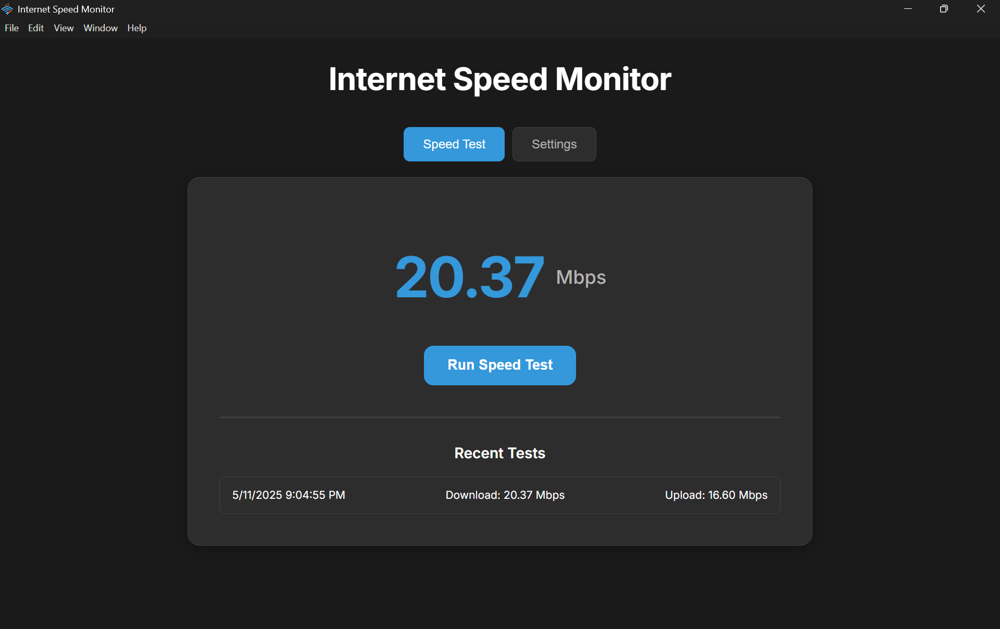

# Speed Monitor

An Electron-based desktop application for monitoring your internet connection speed with real-time notifications and history tracking.




## Features

- 🚀 Real-time speed testing with live updates
- 📊 Historical speed test data tracking
- 🔔 Customizable speed threshold notifications
- ⚙️ Configurable testing intervals
- 🎯 System tray integration for easy access
- 🌓 Automatic dark/light theme support
- 🔄 Run at system startup option

## Prerequisites

Before you begin, ensure you have installed:
- [Node.js](https://nodejs.org/) (version 14 or higher)
- npm (usually comes with Node.js)

## Installation

1. Clone the repository:
   ```bash
   git clone <repository-url>
   cd speed-monitor
   ```

2. Install dependencies:
   ```bash
   npm install
   ```

3. Start the application:
   ```bash
   npm start
   ```

## Usage

### Running Speed Tests
- Click the "Run Speed Test" button to initiate a manual speed test
- View real-time speed updates during the test
- Results are automatically saved to your test history

### Configuration Options
You can customize the following settings in the application:

- **Speed Threshold (Mbps)**: Set the minimum acceptable download speed (1-1000 Mbps)
- **Check Interval (minutes)**: Configure how often tests should run automatically (5-1440 minutes)
- **Notifications**: Toggle speed alert notifications
- **System Startup**: Choose whether the app should launch on system startup

### System Tray Features
The application runs in the system tray for easy access:
- Click the tray icon to show/hide the main window
- Right-click for quick actions:
  - Open Dashboard
  - Run Speed Test Now
  - Quit Application

## Development

### Project Structure
```
speed-monitor/
├── assets/               # Application icons and images
├── main.js              # Main Electron process
├── preload.js           # Preload script for IPC
├── renderer.js          # Renderer process logic
├── index.html           # Main application window
└── styles.css           # Application styling
```

### Scripts
- `npm start`: Launch the application
- `npm run dev`: Start in development mode with debugging

## Technologies Used

- [Electron](https://www.electronjs.org/) - Desktop application framework
- [speedtest-net](https://www.npmjs.com/package/speedtest-net) - Speed testing functionality
- [node-notifier](https://www.npmjs.com/package/node-notifier) - System notifications

## License

This project is licensed under the GNU General Public License v3.0.  
See the [LICENSE](LICENSE) file for details.


